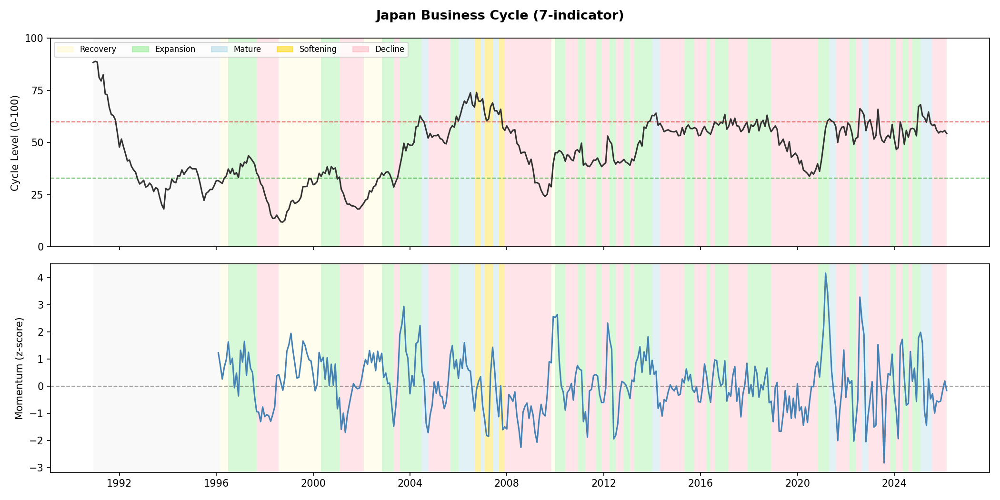
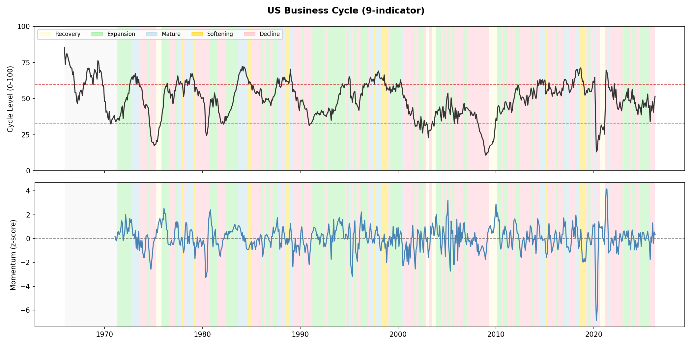
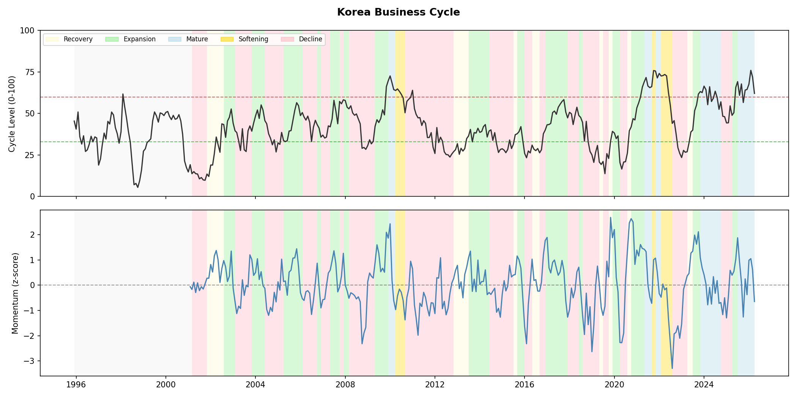

# Business Cycle Report: 2026-05

*生成: 2026-05-19 14:43 UTC*

## サマリー

| 国 | ステージ | Level | Momentum | 前月比 |
|---|---|---|---|---|
| JP | 下降 | 54.4 | -0.16 | ↓ |
| US | 上昇 | 51.6 | +0.36 | ↑ |
| KR | 成熟 | 62.1 | -0.65 | ↓ |

**CN Signal:** BCI 0.60 (Expanding) [2026-04]  
*(OECD Mfg Business Confidence — NBS/Caixin PMI is not available on FRED/OECD)*

## ステージ推移（直近6ヶ月）

### JP

| 月 | Level | Momentum | Stage |
|---|---|---|---|
| 2025-10 | 56.0 | -0.54 | 下降 |
| 2025-11 | 54.6 | -0.59 | 下降 |
| 2025-12 | 55.3 | -0.55 | 下降 |
| 2026-01 | 55.1 | -0.15 | 下降 |
| 2026-02 | 55.8 | +0.19 | 下降 |
| 2026-03 | 54.4 | -0.16 | 下降 |

### US

| 月 | Level | Momentum | Stage |
|---|---|---|---|
| 2025-11 | 45.2 | +0.15 | 下降 |
| 2025-12 | 41.4 | -0.31 | 下降 |
| 2026-01 | 48.0 | +1.31 | 下降 |
| 2026-02 | 40.6 | -0.40 | 下降 |
| 2026-03 | 47.2 | +0.56 | 下降 |
| 2026-04 | 51.6 | +0.36 | 上昇 |

### KR

| 月 | Level | Momentum | Stage |
|---|---|---|---|
| 2025-11 | 64.1 | +0.25 | 成熟 |
| 2025-12 | 64.4 | -0.38 | 成熟 |
| 2026-01 | 67.6 | +0.99 | 成熟 |
| 2026-02 | 76.0 | +1.05 | 成熟 |
| 2026-03 | 71.9 | +0.62 | 成熟 |
| 2026-04 | 62.1 | -0.65 | 成熟 |

## チャート

## データカバレッジ

- **JP**: 1990-12 ~ 2026-03 (424 obs)
- **US**: 1965-12 ~ 2026-04 (725 obs)
- **KR**: 1995-12 ~ 2026-04 (365 obs)
