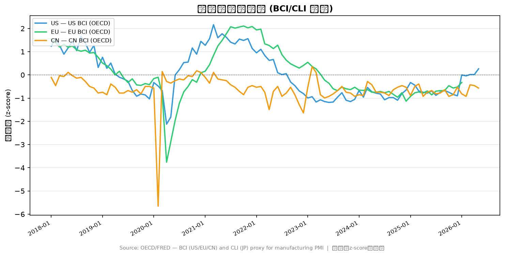
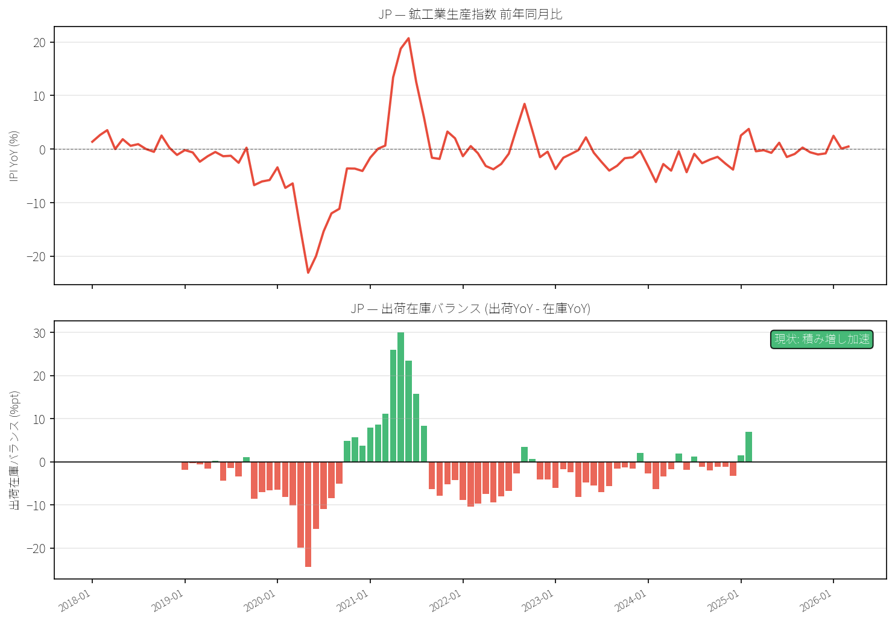
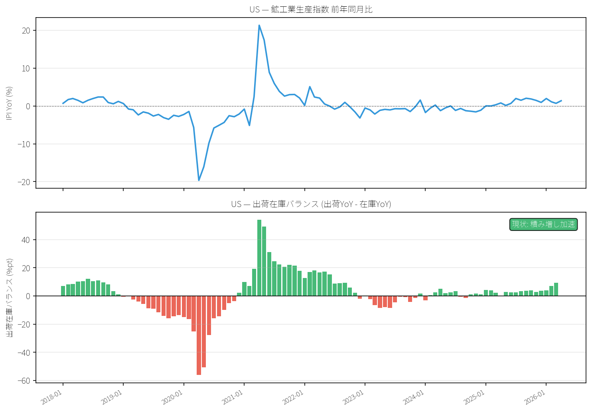
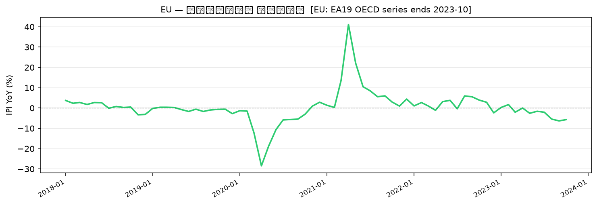
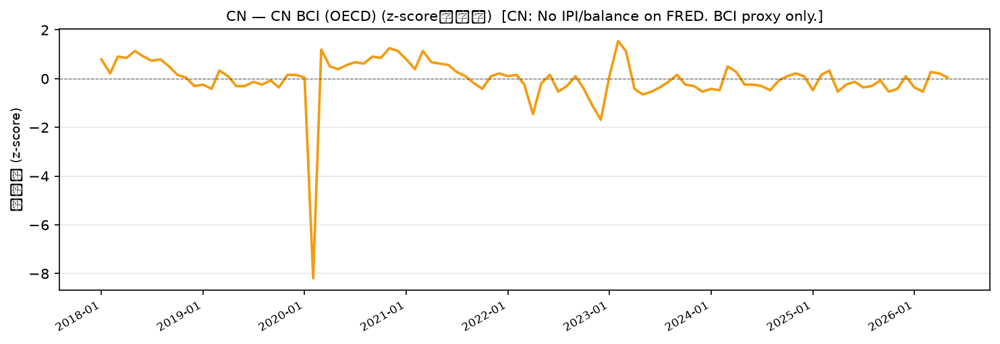

# Business Cycle Report: 2026-05

*生成: 2026-05-25 12:31 UTC*

## サマリー

| 国 | ステージ | Level | Momentum | 前月比 |
|---|---|---|---|---|
| JP | 下降 | 54.4 | -0.16 | ↓ |
| US | 下降 | 46.7 | -0.06 | ↓ |
| KR | 成熟 | 62.1 | -0.65 | ↓ |

**CN Signal:** BCI 0.60 (Expanding) [2026-04]  
*(OECD Mfg Business Confidence — NBS/Caixin PMI is not available on FRED/OECD)*

## ステージ推移（直近6ヶ月）

### JP

| 月 | Level | Momentum | Stage |
|---|---|---|---|
| 2025-10 | 56.0 | -0.54 | 下降 |
| 2025-11 | 54.6 | -0.59 | 下降 |
| 2025-12 | 55.3 | -0.55 | 下降 |
| 2026-01 | 55.1 | -0.15 | 下降 |
| 2026-02 | 55.8 | +0.19 | 下降 |
| 2026-03 | 54.4 | -0.16 | 下降 |

### US

| 月 | Level | Momentum | Stage |
|---|---|---|---|
| 2025-11 | 44.8 | +0.12 | 下降 |
| 2025-12 | 41.6 | -0.26 | 下降 |
| 2026-01 | 47.7 | +1.33 | 下降 |
| 2026-02 | 40.3 | -0.39 | 下降 |
| 2026-03 | 47.6 | +0.58 | 下降 |
| 2026-04 | 46.7 | -0.06 | 下降 |

### KR

| 月 | Level | Momentum | Stage |
|---|---|---|---|
| 2025-11 | 64.1 | +0.25 | 成熟 |
| 2025-12 | 64.4 | -0.38 | 成熟 |
| 2026-01 | 67.6 | +0.99 | 成熟 |
| 2026-02 | 76.0 | +1.05 | 成熟 |
| 2026-03 | 71.9 | +0.62 | 成熟 |
| 2026-04 | 62.1 | -0.65 | 成熟 |

## チャート

## データカバレッジ

- **JP**: 1990-12 ~ 2026-03 (424 obs)
- **US**: 1965-12 ~ 2026-04 (725 obs)
- **KR**: 1995-12 ~ 2026-04 (365 obs)

## 在庫循環分析

*データ生成: 2026-05-24*

### AI解釈

日米両市場はともに「積み増し加速」フェーズにあり、在庫循環上は出荷・在庫バランスが改善方向にある点で共通しているが、回復の深度と業種構造には顕著な差異が見られる。日本は早・中・晩サイクル平均がそれぞれ56・54・61ptと比較的均質な回復を示しており、プラスチック製品・金属製品（各68pt）や電子部品・デバイス（63pt）が牽引する一方、汎用・業務用機械（40pt）や鉄鋼・非鉄金属（46pt）は出遅れており、素材・資本財セクターの回復格差が残存している。米国はコンピューター・電子機器が84ptとサイクルピーク圏に達し突出した強さを見せているが、輸送機械・プラスチック・ゴム・一次金属はいずれも20pt前後と調整底圏に近く、晩サイクル平均19ptが示すように川上・川下の分断が極めて大きい。全体として日本は緩やかながらも広域的な回復過程にあるのに対し、米国はハイテク主導の局所的な積み増し加速に留まっており、素材・製造業の裾野には依然として相当の調

### フェーズ判定

| 国 | フェーズ | 前回判定 | 変化 |
|---|---|---|---|
| JP | 積み増し加速 | 積み増し加速 | 変化なし |
| US | 積み増し加速 | 積み増し加速 | 変化なし |
| EU | — | — | — |
| CN | — | — | — |

★ = 前回判定から変化あり

### 業種別回復スコア

### JP — 回復スコア

**上位3業種 (最も回復)**

| 業種 | スコア |
|---|---|
| プラスチック製品 | 67.8pt |
| 金属製品 | 67.8pt |
| 電子部品・デバイス | 63.2pt |

**下位3業種 (最も低迷)**

| 業種 | スコア |
|---|---|
| 汎用・業務用機械 | 39.6pt |
| 鉄鋼・非鉄金属 | 46.0pt |
| 化学工業（除．医薬品） | 49.7pt |

### US — 回復スコア

**上位3業種 (最も回復)**

| 業種 | スコア |
|---|---|
| コンピューター・電子機器 | 84.0pt |
| 電気機械 | 59.0pt |
| 紙製品 | 52.9pt |

**下位3業種 (最も低迷)**

| 業種 | スコア |
|---|---|
| 輸送機械 | 18.9pt |
| プラスチック・ゴム | 20.2pt |
| 一次金属 | 20.3pt |

### チャート

