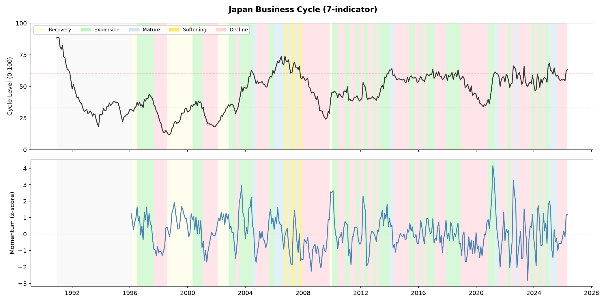
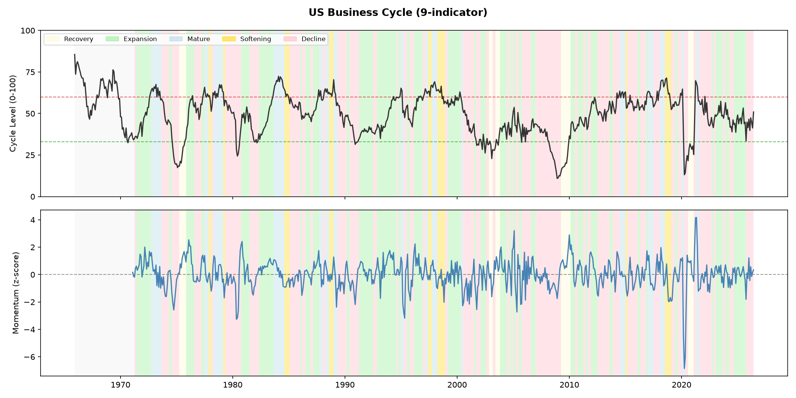
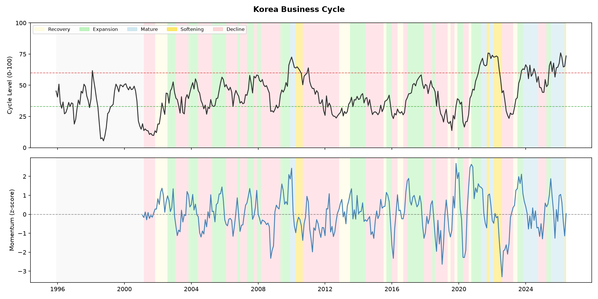
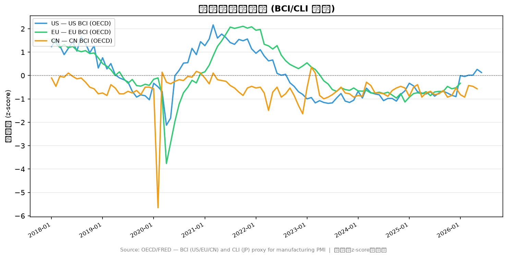
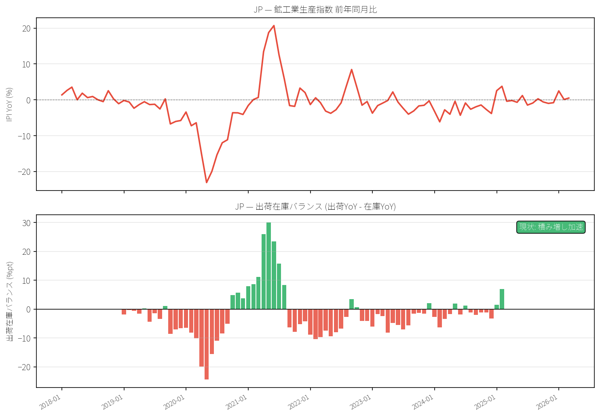
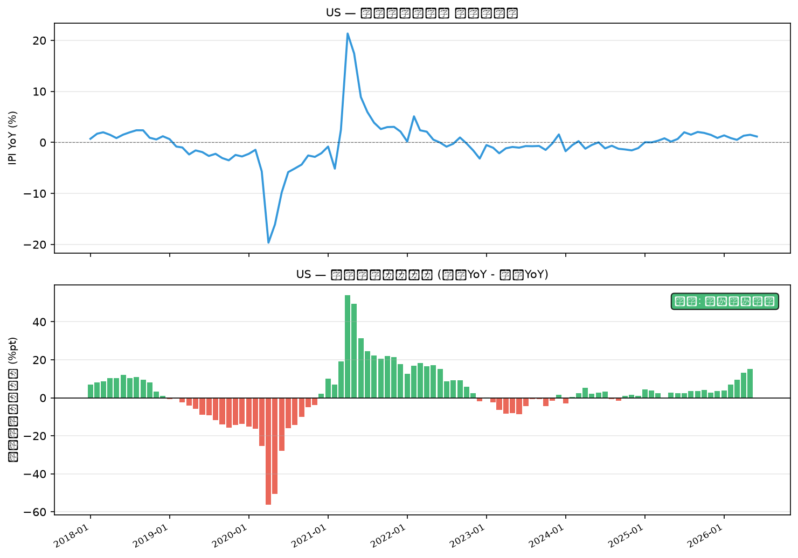
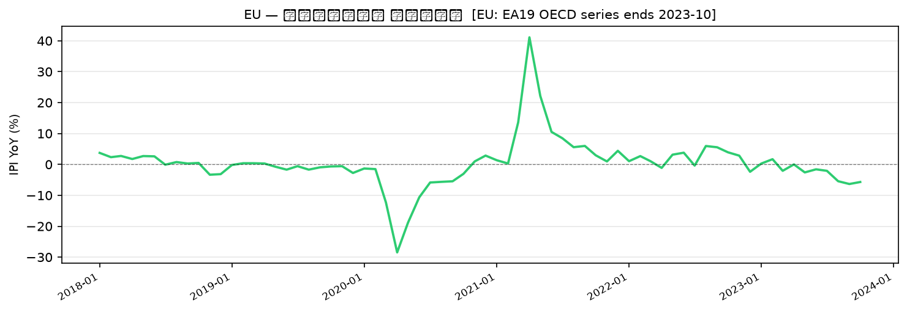
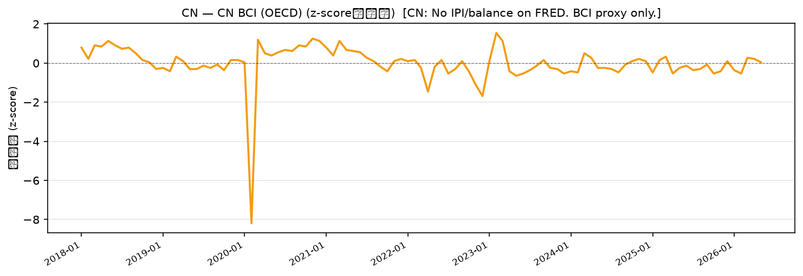

# Business Cycle Report: 2026-07

*生成: 2026-07-25 10:26 UTC*

## サマリー

| 国 | ステージ | Level | Momentum | 前月比 |
|---|---|---|---|---|
| JP | 成熟 | 63.2 | +1.20 | ↑ |
| US | 上昇 | 50.9 | +0.34 | ↑ |
| KR | 軟化 | 73.5 | +0.03 | ↑ |

**CN Signal:** BCI 0.00 (Expanding) [2026-05]  
*(OECD Mfg Business Confidence — NBS/Caixin PMI is not available on FRED/OECD)*

## ステージ推移（直近6ヶ月）

### JP

| 月 | Level | Momentum | Stage |
|---|---|---|---|
| 2025-12 | 55.3 | -0.55 | 下降 |
| 2026-01 | 55.1 | -0.15 | 下降 |
| 2026-02 | 55.8 | +0.19 | 下降 |
| 2026-03 | 54.4 | -0.16 | 下降 |
| 2026-04 | 62.3 | +1.19 | 下降 |
| 2026-05 | 63.2 | +1.20 | 成熟 |

### US

| 月 | Level | Momentum | Stage |
|---|---|---|---|
| 2026-01 | 46.5 | +1.22 | 下降 |
| 2026-02 | 39.8 | -0.43 | 下降 |
| 2026-03 | 47.4 | +0.57 | 下降 |
| 2026-04 | 44.8 | -0.14 | 下降 |
| 2026-05 | 41.3 | +0.16 | 下降 |
| 2026-06 | 50.9 | +0.34 | 上昇 |

### KR

| 月 | Level | Momentum | Stage |
|---|---|---|---|
| 2026-01 | 67.6 | +0.99 | 成熟 |
| 2026-02 | 76.0 | +1.05 | 成熟 |
| 2026-03 | 72.2 | +0.64 | 成熟 |
| 2026-04 | 64.7 | -0.39 | 成熟 |
| 2026-05 | 65.2 | -1.14 | 軟化 |
| 2026-06 | 73.5 | +0.03 | 軟化 |

## チャート

## データカバレッジ

- **JP**: 1990-12 ~ 2026-05 (426 obs)
- **US**: 1965-12 ~ 2026-06 (727 obs)
- **KR**: 1995-12 ~ 2026-06 (367 obs)

## 在庫循環分析

*データ生成: 2026-07-25*

### AI解釈

USの在庫循環は積み増し加速フェーズ（回復スコア最上位: コンピューター・電子機器 91pt）。

### フェーズ判定

| 国 | フェーズ | 前回判定 | 変化 |
|---|---|---|---|
| JP | 取得失敗 | — | — |
| US | 積み増し加速 | 積み増し加速 | 変化なし |
| EU | データなし | データなし | 変化なし |
| CN | データなし | データなし | 変化なし |

★ = 前回判定から変化あり

### 業種別回復スコア

### US — 回復スコア

**上位3業種 (最も回復)**

| 業種 | スコア |
|---|---|
| コンピューター・電子機器 | 90.8pt |
| 電気機械 | 82.8pt |
| 一般機械 | 54.1pt |

**下位3業種 (最も低迷)**

| 業種 | スコア |
|---|---|
| 一次金属 | 26.1pt |
| 石油化学・化学 | 41.8pt |
| 紙製品 | 46.2pt |

### チャート

